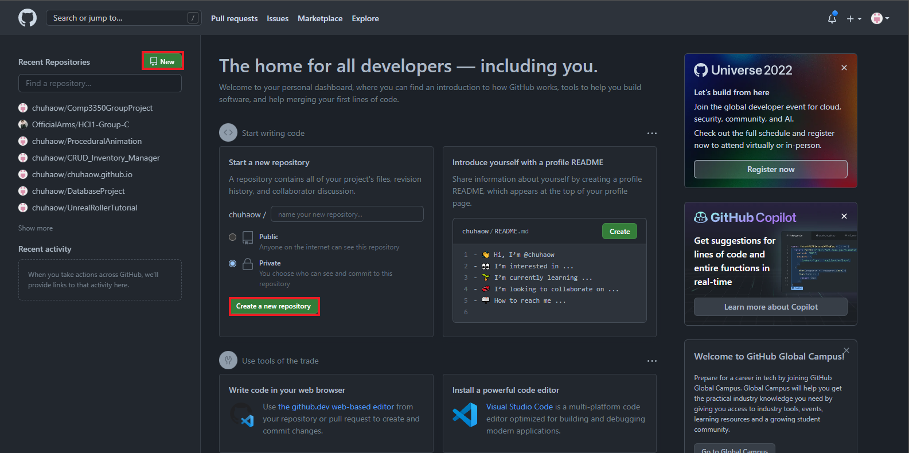
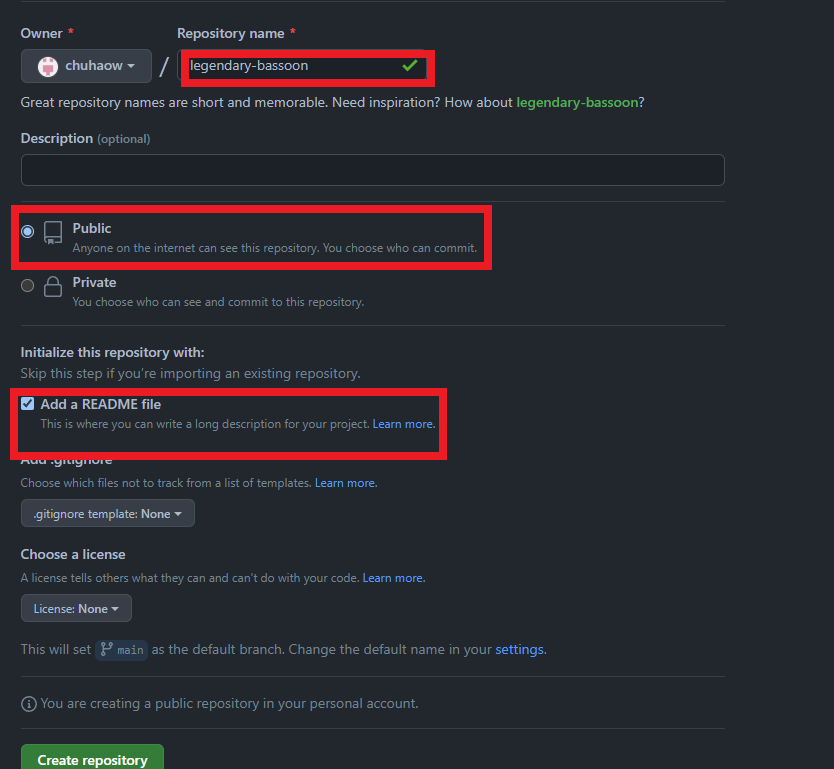
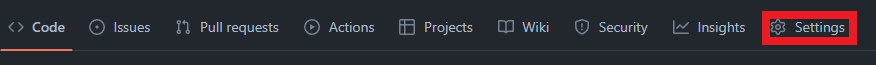
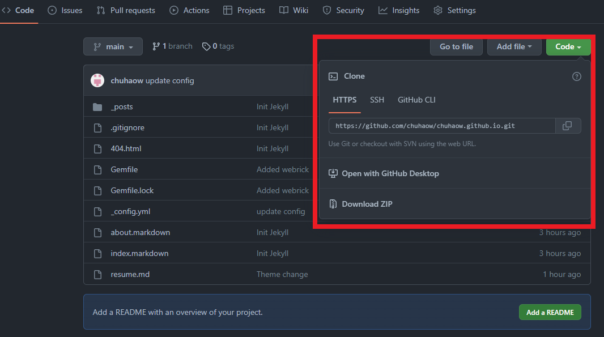
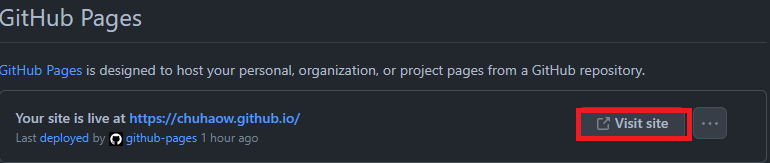

# Static Websites And GitHub Pages

This project is a demonstration of how to use the static website generator Jekyll with GitHub Pages

## Purpose
Explain how to host a resume on GitHub Pages. Also, introduce and demonstrate the principles of Andrew Etter's book Modern Technical Writing
## Getting Started

## Prerequisites

Requirements for the software and tools used in this guide. 
- [GitHub Account](https://github.com/join)
- [Git](https://git-scm.com/downloads)
- [Ruby ( If you are on Windows the installer is recommended)](https://www.ruby-lang.org/en/downloads/)
- [Jekyll](https://jekyllrb.com/docs/installation/)
## Instructions
### Step 1: Creating a GitHub Repository

1. Start the creation of a repository by select either button from your main page 

2. Enter the required information of your repository
    - Enter repository name
    - Set visibility to public
    - Select option to initialize repository with a README
    - Click **Create repository**

3. In the newly created repository navigate to **Settings**

4. In the sidebar click **Pages**
5. Set the deployment source to *Deploy from a branch* under the **Source** section
6. Set the desired publishing branch under the **Branch** section
    - To keep it simple it is recommended that the main branch and root directory is the publishing branch

7. Click Save
## Step 2: Setting up Jeykell for your repository

1. Click on the **Code** tab of your repository
2. Click on the green Code button
3. Copy the URL for your repository

4. Open the command prompt by searching "Command Prompt" in your OS search function
5. Create a new directory on your computer for your local repository
6. Navigate to the new directory where you want to clone the repository to by running the following command replacing the placeholder path with your actual path
```
cd path/to/your/directory
```
7. Run the follow command. Besure to replace {YOUR GITHUB REPO URL} with the URL copied in step 2.3
```
git clone {YOUR GITHUB REPO URL}
```
8. Navigate into the newly clone repository by running, replacing the placehold path with the actual path to the local repository
```
cd path/to/your/repository 
```
9. Run ```jekyll new --skip-bundle .```
    - You may need to run the command as 
    ```
    jekyll new --skip-bundle --force .
    ```
    if there are conflicts
10. Open the Gemfile created by Jekyll
11. Comment out the line that start with ```gem “jekyll” ```with #
12. replace the comment the ```# gem "github-pages"``` with ```gem "github-pages", "~> 227", group: :jekyll_plugins```
13. Save the Gemfile
14. Run ```bundle install``` from the command prompt
15. Commit changes to the remote repository by running the follow command in the command prompt
  - ```git add . ``` adds all the changes you have made to a staging area
  - ```git commit -m "Initial GitHub pages site with Jekyll"``` takes the changes that have are in the staging area and commits the changes. The -m is a flag and the text in double quotes that follow it is a message about the commited changes.
16. Push your changes to the remote repository with the following command replacing BRANCH with your branch name
```
git push -u origin BRANCH 
```
- Note: You may be prompted to authorize the action, you can do some play following the steps in the prompt.

### Step 3: Adding your resume

1. Add your resume to the directory you had set for publishing in Step 1.6 in the local repository you cloned
2. Run ```git add . ``` 
2. Run ```git commit -m "adding resume"``` 
3. Run ```git push -u origin BRANCH ``` again replacing BRANCH with your branch name

### Step 4: Changing the Theme
1. Open the *_config.yml* file in your local repository

2. Add the following replace ```REMOTE/THEME/LOCATION``` to the location of one of the [supported themes](https://pages.github.com/themes/)
  - NOTE: For more information as to what to place in the ```remote_theme``` parameter see the README in the theme's repository 

```
remote_theme: REMOTE/THEME/LOCATION
plugins:
  - jekyll-remote-theme
```
3. Run ```git add . ``` 
4. Run ```git commit -m 'Changing theme'``` 
6. Run ```git push -u origin BRANCH ``` again replacing BRANCH with your branch name
-Note: Use ```theme: THEME_NAME``` instead if the theme is not remote.

## Running Jekyll Locally
Now that the set up done lets take a look at how to run Jekyll Locally
1. Run ```gem install bundler``` to install bundler
2. Run ```bundle exec jekyll serve``` while in your root directory to start your website
- If you see the follow error in this step run ```bundle add webrick``` then re-run ```bundle exec jekyll serve```
```
Cannot load such file -- webrick (LoadError)
```
3. Navigate to the server address displayed in your browser 
4. Add ```/RESUMENAME``` to the end of the URL, replacing RESUMENAME with the name of your resume file

## View Your Static Page
1. Navigate to the settings tab of your repository
2. Click on Pages on the sidebar
3. Click vist site

4. Add ```/RESUMENAME``` where RESUMENAME is the name of the resume you upload to the URL

## Relation Between Etter's Concepts and Steps to Hosting a Static Site

Etter's Book "Modern Technical Writing" describes many concepts and practices of modern technical writing that you have just done by following the steps above. Lets examine the core concepts and how the relate to the steps we just did.  

1. Use a lightweight markup language

  - There are many benefits to using a markup language. First, it is human-readable, thus makes it easier for almost anyone to contribute. In Etter's book it is highlighted that having documentation that encourages others to contribute provides a great advantage. It allows you to take use the knowledge of more people.Second, unlike What You See Is What You Get(WYSIWYG) editors, lightweight markup languages are more portable and able to function on all operating systems. This again makes it easier for people to contribute as compatibility issues won’t block them. We can see effects of using a lightweight markup language is in the step **Step 4: Changing the Theme**. When do Step 4 you might have noticed how easy to was to know what each parameter did in the _config.yml. As we can see, this is the effect of a lightweight markup language like yml, even without knowing yml, it was intutive what needs to change for the theme to change.

2. Format a document with a static site generator

  - Static sites are a simple, fast, and portable way to format your documents. Unlike full-on websites, static sites are much more lightweight. They have no database and are independent of server-side programs, as such, they are perfect for documents. In Etter’s book, the recommended way to create static websites is through and generator, such as Jekyll which we are using here. While we are using Jekyll it should be noted that the one recommended in Etter’s book is Sphinx, as was built for documentation and has a search built into the static site. In Etter’s book, it is noted that the selection of a theme is important. A theme with a good interface and a search function is important to the site. We have demostrated this concept through **Step 2** and **Step 4** where we set up a static site generator and select a theme.

3. Share/host documents on a distributed version control system

- Distributed version control systems (DVCS) are a great way to allow for concurrent work on the same file without any headaches. While most DVCS are overkill for the documentation workflow, it is still important to them as most developers with use them. According to Etter, the big appeal to DVCS is that they allow documentation and code to stay in sync, and it encourages developers to contribute as well. While Git/GitHub may seem complicated, however, after setting up local, the workflow really just boils down to making changes, committing, and pushing. We demonstrated this concept in **Step 1** where we set up the remote repository, in **Step 2** where we set up the local repositroy and we demostrated the workflow of changing/adding a file in **Step 3** where we uploaded the resume.


## Authors and Acknowledgements

  - [Contributor Covenant](https://www.contributor-covenant.org/) - Used
    for the Code of Conduct
  - [Creative Commons](https://creativecommons.org/) - Used to choose
    the license

## FAQ

Please read [CONTRIBUTING.md](CONTRIBUTING.md) for details on our code
of conduct, and the process for submitting pull requests to us.
